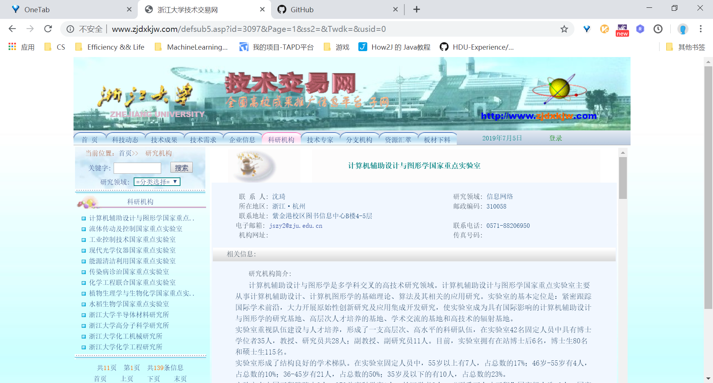
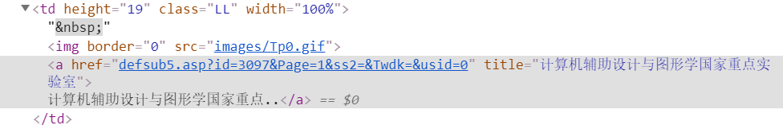
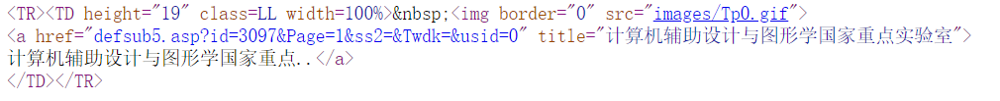
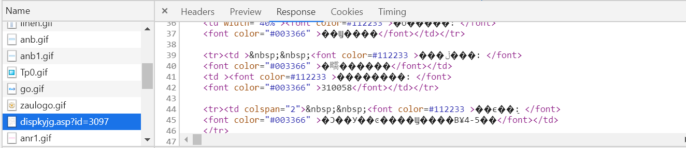
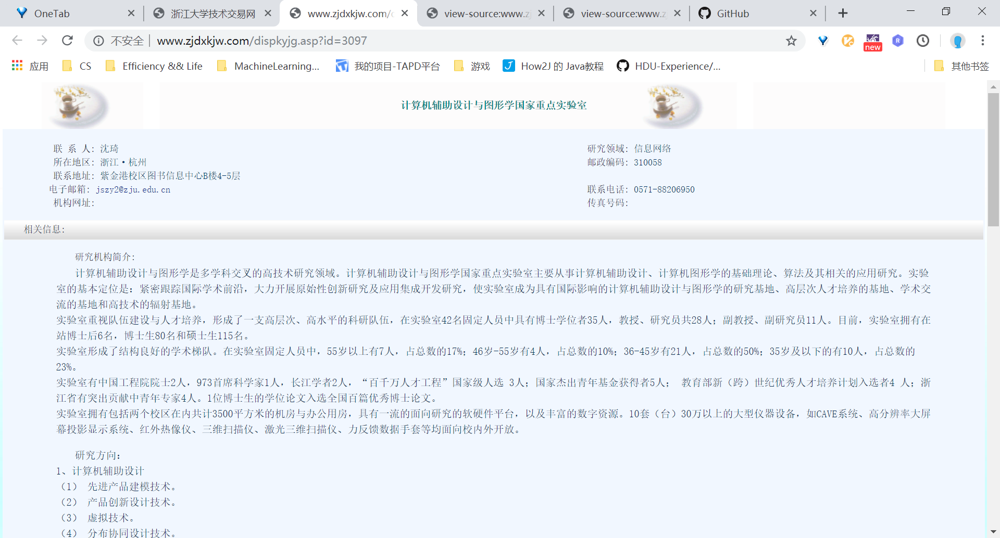
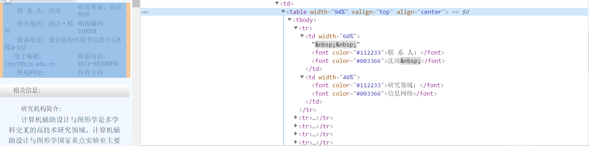

# 浙江大学技术交易网爬虫

> 因为是帮学长写的， 比较仓促， 注释和命名都没注意
>
> 页面是asp也有点和之前接触的不一样，所以写下来

## 需求再现

* 爬取[浙江大学技术交易网](http://www.zjdxkjw.com/defsub5.asp)所有科研机构的名称与联系人信息(当然如果想爬文章信息也不难)

  

## 爬取过程

#### 爬取所有科研机构网址

* 分页

  * `http://www.zjdxkjw.com/defsub5.asp?id=3097&Page=1&ss2=&Twdk=&usid=0`可以看到直接根据page就能分页

* 每一页具体地址

  * 
  * 看样子应该是定位这个`class`为`LL`就行了, 但是会发现找不到, 查看源代码会发现这个
  * 
  * 可见源代码根本不是html, `BeautifulSoup`无法解析
  * 于是直接用正则`r'\<a href=\"defsub5\.asp\?(.{1,50})\" title=\"'`, 特意看过，因为有前面`defsub5`和后面的`title`保证能精确匹配到所有网址，不多也不少
  


### 爬取每一个科研机构的信息

* 请求得到页面所有信息(所有`requests.get().text`)

  > 一开始以为很简单，后来才发现并不
  
  * 直接请求网址，得到的信息里面根本不含页面右部的信息，无论是联系人还是文章主体
  * 于是分析`network`
  * 
  * 别的都是`CSS`和图片，只有这一条有点像数据(右边乱码是因为网页编码格式`gbk`)
  * 于是点开查看
  * 
  * 这就是说正确网址!!!
  * 其实他左边应该是一个目录，右边是动态刷新
    * 所以之前的url是`http://www.zjdxkjw.com/defsub5.asp?id=3097&Page=1&ss2=&Twdk=&usid=0`我用正则拿到的是`id=3097&Page=1&ss2=&Twdk=&usid=0`,而正确的是`http://www.zjdxkjw.com/dispkyjg.asp?id=3097`，所以只需要把id拿出来拼接一下就是，用字符串截取
    * 但是后来发现报错！！！因为有的id长度为3，有的为2，所以还得用正则, `r"^([0-9]{2,4})"`
  
* 获取页面信息

  * 
  
  * 找了一下刚好可以利用`width`为`94%`这个属性提取，刚好只有这一个
  
  * 再用调试工具就能精确找到具体每个信息的获取方式, 注意有的属性可以为空
  
  * ```Python
    name = info_block[0].contents[1].next.contents[3].text.rstrip()
    
    email = ""
    email_info = info_block[0].contents[7].contents[0].contents[2].contents[0].contents
    if len(email_info) > 0:
        # email可能为空
        #之前这里报异常弄了我很久
        email = email_info[0]
    
    
    phone = ""
    phone_info = info_block[0].contents[7].contents[2].contents[2].contents
    if len(phone_info) > 0:
        phone = phone_info[0]
    ```
  
  * 机构名称也好找，直接给代码`title = soup.find_all('b')[0].contents[0]`

### 保存

* 用`csv`, 并且可以用excel打开，可以直接给学长